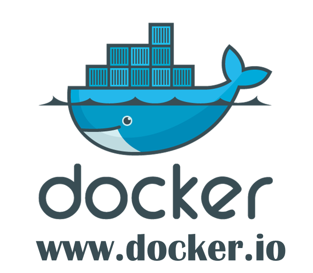

<!-- $theme: default -->


# Docker 101

---

## What is Docker ???

Docker is the world's leading software containerization platform



---

>PACKAGE YOUR APPLICATION INTO A STANDARDIZED UNIT FOR SOFTWARE DEVELOPMENT

Docker containers wrap a piece of software in a complete filesystem that contains everything needed to run: code, runtime, system tools, system libraries – anything that can be installed on a server. This guarantees that the software will always run the same, regardless of its environment.

---

* LIGHTWEIGHT
Containers running on a single machine share the same operating system kernel; they start instantly and use less RAM. Images are constructed from layered filesystems and share common files, making disk usage and image downloads much more efficient.
* OPEN
Docker containers are based on open standards, enabling containers to run on all major Linux distributions and on Microsoft Windows -- and on top of any infrastructure.
* SECURE BY DEFAULT
Containers isolate applications from one another and the underlying infrastructure, while providing an added layer of protection for the application.

---


----

### Docker Engine
The Docker Engine is a lightweight container runtime and robust tooling that builds and runs your container. Docker allows you to package up application code and dependencies together in an isolated container that share the OS kernel on the host system. The in-host daemon communicates with the Docker Client to execute commands to build, ship and run containers.


---

### Docker Compose


Compose is a tool for defining and running multi-container Docker applications. With Compose, you use a Compose file to configure your application's services. Then, using a single command, you create and start all the services from your configuration. To learn more about all the features of Compose see the list of features.

---

A docker-compose.yml looks like this:
```
version: '2'

services:
  web:
    build: .
    ports:
     - "5000:5000"
    volumes:
     - .:/code
  redis:
    image: redis
```

---

### DOCKER REGISTRY
>DOCKER REGISTRY => Docker Hub === Git => Git Hub
>[hub.docker.com](https://hub.docker.com)


---
The Docker toolset to pack, ship, store, and deliver content.

This repository's main product is the Docker Registry 2.0 implementation for storing and distributing Docker images. It supersedes the docker/docker-registry project with a new API design, focused around security and performance.

---

### Docker Machine


Machine lets you create Docker hosts on your computer, on cloud providers, and inside your own data center. It creates servers, installs Docker on them, then configures the Docker client to talk to them.

----

### Swarm: a Docker-native clustering system


Docker Swarm is native clustering for Docker. It turns a pool of Docker hosts into a single, virtual host.

----

### Kitematic
Kitematic is a simple application for managing Docker containers on Mac, Linux and Windows.


---

## Containers vs VMs
>Containers and virtual machines have similar resource isolation and allocation benefits -- but a different architectural approach allows containers to be more portable and efficient.

* VIRTUAL MACHINES
Virtual machines include the application, the necessary binaries and libraries, and an entire guest operating system -- all of which can amount to tens of GBs.
* CONTAINERS
Containers include the application and all of its dependencies --but share the kernel with other containers, running as isolated processes in user space on the host operating system. Docker containers are not tied to any specific infrastructure: they run on any computer, on any infrastructure, and in any cloud.

---


----


---
* Containers are more lightweight
* No need to install guest OS
* Less CPU,RAM,storage space required
* More containers per machine than VMs

---

## Docker Engine
> The core of the Docker platform is a lightweight container runtime with built in orchestration


```bash
$ docker run ubuntu /bin/echo 'Hello world'

Hello world
```

```bash
$ docker run -it ubuntu /bin/bash
```

---
### Install Docker Engine


----

### Images
* Read only template used to create containers
* Buuilt by you or other Docker users
* Stored in  the Docker Hub or your local Registry

---


---
```bash
$ docker images
$ docker rmi [i]
$ docker pull [i]
$ docker push [i]
$ docker tags [n] [t]
$ docker search [c]
```

---

### Containers
* Isolated application platform
* Contains everything needed to run your application
* Based on images

---


---

```bash
$ docker ps
$ docker run [n]
$ docker rm [c]
$ docker start [c]
$ docker stop [c]
$ docker inspect [c]
$ docker top [c]
$ docker log [c]
```
---
```
$ docker run -d ubuntu /bin/sh -c "while true; do echo hello world; sleep 1; done"
```
---
You can run this container in following way. You can then access the WebDAV instance at `http://localhost:8888/webdav`. Internally the folder `/var/webdav` is used as WebDAV root.

```
$ docker run -d -e USERNAME=test -e PASSWORD=test -p 8888:80 morrisjobke/webdav
```

---

### Docker File

```
$ docker build -t tr/mongo:v1 .
```

---
```
#
# MongoDB Dockerfile
#
# https://github.com/dockerfile/mongodb
#

# Pull base image.
FROM dockerfile/ubuntu

# Install MongoDB.
RUN \
  apt-key adv --keyserver hkp://keyserver.ubuntu.com:80 --recv 7F0CEB10 && \
  echo 'deb http://downloads-distro.mongodb.org/repo/ubuntu-upstart dist 10gen' > /etc/apt/sources.list.d/mongodb.list && \
  apt-get update && \
  apt-get install -y mongodb-org && \
  rm -rf /var/lib/apt/lists/*
```
---
```
# Define mountable directories.
VOLUME ["/data/db"]

# Define working directory.
WORKDIR /data

# Define default command.
CMD ["mongod"]

# Expose ports.
#   - 27017: process
#   - 28017: http
EXPOSE 27017
EXPOSE 28017
```

---
## Example

...

---
# END

---
