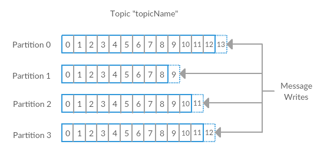

# Meet Kafka

#HSLIDE

`Apache Kafka` is a `publish/subscribe messaging system` designed to solve this problem. It is often described as a `distributed commit log` or more recently a `distributing streaming platform`. A filesystem or database commit log is designed to provide a durable record of all transactions so that they can be replayed to consistently build the state of a system. Similarly, `data` within Kafka is stored `durably`, `in order`, and can be `read deterministically`. In addition, the data can be `distributed` within the system to provide additional protections against failures, as well as significant opportunities for `scaling` performance.

#HSLIDE

**Messages and Batches**

`The unit of data within Kafka is called a message.` If you are approaching Kafka from a database background, you can think of this as `similar to a row or a record`. A message is simply an array of bytes, as far as Kafka is concerned, so the data contained within it does not have a specific format or meaning to Kafka. Messages can have an optional bit of metadata which is referred to as a key. The key is also a byte array, and as with the message, has no specific meaning to Kafka. `Keys are used when messages are to be written to partitions in a more controlled manner.` The simplest such scheme is to treat partitions as a hash ring, and assure that messages with the same key are always written to the same partition.

For efficiency, messages are written into Kafka in batches. A batch is just a collection of messages, all of which are being produced to the same topic and partition.

#HSLIDE

**Topics and Partitions**

Messages in Kafka are categorized into `topics`. The closest analogy for a topic is a database table, or a folder in a filesystem. `Topics are additionally broken down into a number of partitions.` Going back to the “commit log” description, a partition is a single log. Messages are written to it in an `append-only` fashion, and are `read in order` from beginning to end. Note that as a topic generally has multiple partitions, there is `no guarantee of time-ordering of messages across the entire topic, just within a single partition`. Figure shows a topic with 4 partitions, with writes being appended to the end of each one. `Partitions` are also the way that Kafka `provides` `redundancy and scalability`. Each partition can be hosted on a different server, which means that a single topic can be scaled horizontally across multiple servers to provide for performance far beyond the ability of a single server.

#HSLIDE

#HSLIDE

**Producers and Consumers**

`Producers create new messages.` In other publish/subscribe systems, these may be called publishers or writers. In general, a message will be produced to a specific topic. By default, the producer does not care what partition a specific message is written to and will balance messages over all partitions of a topic evenly. In some cases, the producer will direct messages to specific partitions. This is typically done using the message key and a partitioner that will generate a hash of the key and map it to a specific partition. This assures that all messages produced with a given key will get written to the same partition. The producer could also use a custom partitioner that follows other business rules for mapping messages to partitions. Producers are covered in more detail in Chapter 3.

#HSLIDE

`Consumers read messages.` In other publish/subscribe systems, these clients may be called subscribers or readers. The consumer subscribes to one or more topics and reads the messages in the order they were produced. The consumer keeps track of which messages it has already consumed by keeping track of the offset of messages. `The offset is another bit of metadata, an integer value that continually increases, that Kafka adds to each message as it is produced.` Each message within a given partition has a unique offset. By storing the offset of the last consumed message for each partition, either in Zookeeper or in Kafka itself, a consumer can stop and restart without losing its place.

#HSLIDE

Consumers work as part of a consumer group. `This is one or more consumers that work together to consume a topic.` The group assures that `each partition is only consumed by one member`. In Figure , there are three consumers in a single group consuming a topic. Two of the consumers are working from one partition each, while the third consumer is working from two partitions. The mapping of a consumer to a partition is often called ownership of the partition by the consumer.

#HSLIDE

#HSLIDE

**Brokers and Clusters**

A single Kafka server is called a broker. `The broker receives messages from producers, assigns offsets to them, and commits the messages to storage on disk.` `It also services consumers, responding to fetch requests for partitions and responding with the messages that have been committed to disk.` Depending on the specific hardware and its performance characteristics, a single broker can easily handle thousands of partitions and millions of messages per second.

Kafka brokers are designed to operate as part of a cluster. Within a cluster of brokers, one will also function as the cluster `controller` (elected automatically from the live members of the cluster). The controller is responsible for administrative operations, including assigning partitions to brokers and monitoring for broker failures. A partition is owned by a single broker in the cluster, and that broker is called the `leader` for the partition. A partition may be assigned to multiple brokers, which will result in the partition being `replicated` . This provides redundancy of messages in the partition, such that another broker can take over leadership if there is a broker failure. However, all consumers and producers operating on that partition must connect to the leader.

#HSLIDE

#HSLIDE
