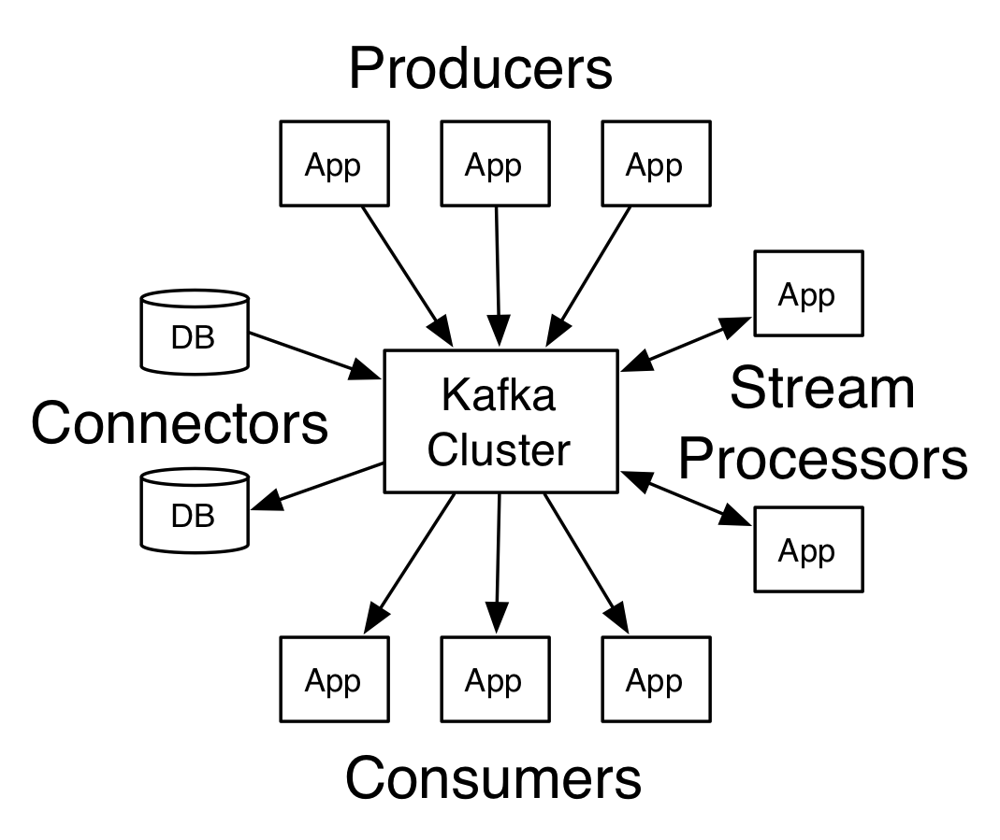

# Meet Kafka

https://gitpitch.com/uname-yang/Slides/kafka_101

It is often described as a **distributed commit log** or more recently a **distributing streaming platform**.

Similarly, `data` within Kafka is stored **durably**, **in order**, and can be **read deterministically**. In addition, the data can be **distributed** within the system to provide additional protections against failures, as well as significant opportunities for **scaling** performance.

**A few concepts:**

* Kafka is run as a cluster on one or more servers.
* The Kafka cluster stores streams of records in categories called topics.
* Each record consists of a key, a value, and a timestamp.

Kafka has four core APIs:

* The **Producer API** allows an application to `publish` a stream of records `to` one or more Kafka `topics`.
* The **Consumer API** allows an application to `subscribe to` one or more `topics` and `process` the stream of `records` produced to them.
* The **Streams API** allows an application to `act as a stream processor`.
* The **Connector API** allows building and running reusable producers or consumers that connect Kafka topics to applications or systems.

## Messages

`The unit of data within Kafka is called a message.` If you are approaching Kafka from a database background, you can think of this as **similar to a row or a record**.

## Topics and Partitions

`A topic is a category or feed name to which records are published.`
The closest **analogy for a topic is a database table, or a folder in a filesystem**.

For each topic, the Kafka cluster maintains a partitioned log that looks like this:

A partition is a single log. Messages are written to it in an **append-only** fashion, and are **read in order** from beginning to end.

Note that as a topic generally has multiple partitions, there is **no guarantee of time-ordering of messages across the entire topic, just within a single partition**.

## Producers and Consumers

**Producers create new messages.**By default, the producer does not care what partition a specific message is written to and will balance messages over all partitions of a topic evenly. In some cases, the producer will direct messages to specific partitions.

**Consumers read messages.** The consumer subscribes to one or more topics and reads the messages in the order they were produced. The consumer keeps track of which messages it has already consumed by keeping track of the offset of messages.

Consumers work as part of a consumer group. Consumers label themselves with a consumer group name, and **each record published to a topic is delivered to one consumer instance within each subscribing consumer group**.

## Brokers and Clusters

A single Kafka server is called a **broker**.

* The broker **receives messages from producers**, assigns offsets to them, and commits the messages to storage on disk.
* It also **services consumers**, responding to fetch requests for partitions and responding with the messages that have been committed to disk.

The partitions of the log are distributed over the servers in the Kafka cluster with each server handling data and requests for a share of the partitions. Each partition is replicated across a configurable number of servers for fault tolerance.

Each partition has one server which acts as the **leader** and zero or more servers which act as **followers**. The leader handles all read and write requests for the partition while the followers passively replicate the leader. If the leader fails, one of the followers will automatically become the new leader.

## Guarantees

At a high-level Kafka gives the following guarantees:

* Messages sent by a producer to a particular topic partition will be appended in the order they are sent.
* A consumer instance sees records in the order they are stored in the log.
* For a topic with replication factor N, we will tolerate up to N-1 server failures without losing any records committed to the log.

## UseCases

**Kafka as a Messaging System**

Kafka has stronger ordering guarantees than a traditional messaging system.

**Kafka as a Storage System**

Data written to Kafka is written to disk and replicated for fault-tolerance.
The disk structures Kafka uses scale well—Kafka will perform the same whether you have  `50 KB or 50 TB` of persistent data on the server.

**Kafka for Stream Processing**

In Kafka a stream processor is anything that takes continual streams of data from input topics, performs some processing on this input, and produces continual streams of data to output topics.
