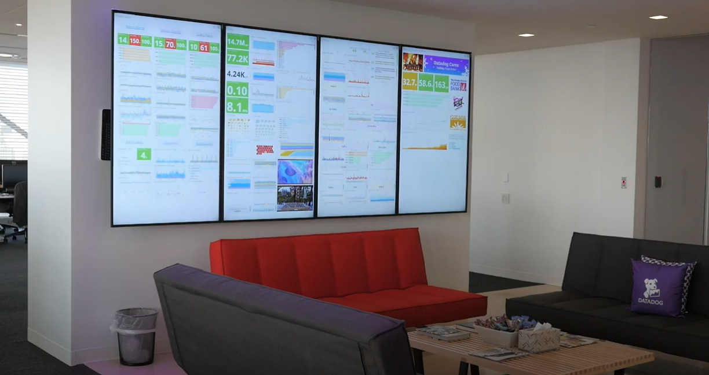
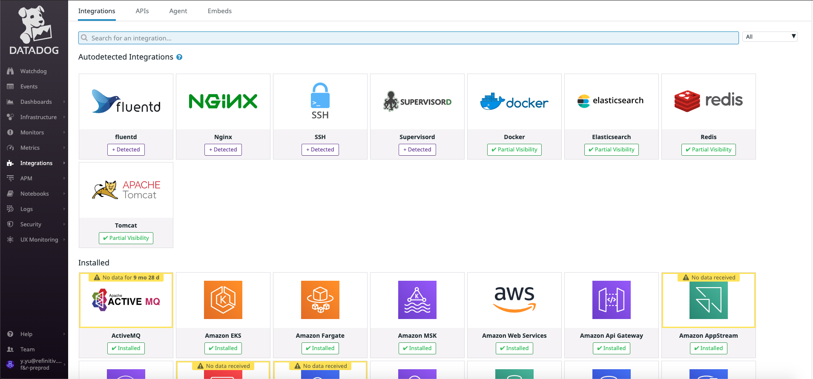
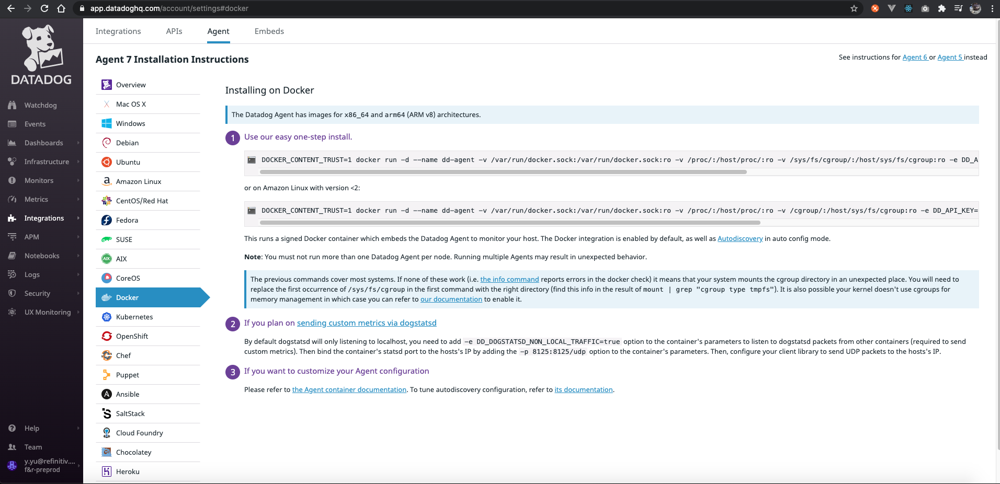
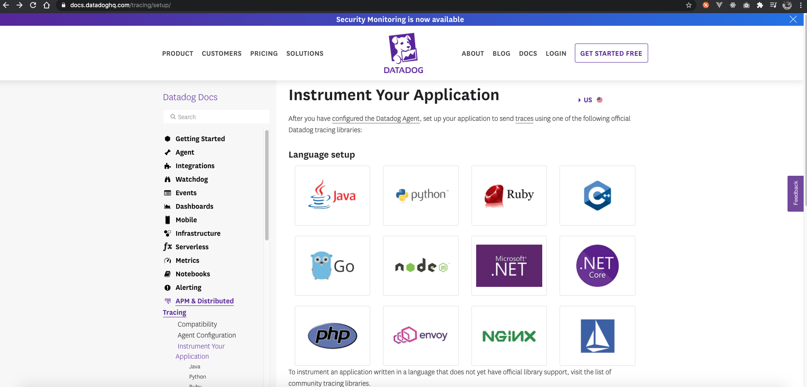

# DataDog 101

> <https://gitpitch.com/uname-yang/Slides/datadog101>

<!-- 
Welcome to Datadog 101, My name is Yang, and I am one of developer in Panda Team in Beijing.
From this sharing session, gets you up and running with the datadog.
-->

## 1 Overview

- Dashboards
- Infrastructure
- Monitors
- Metrics
- Integrations
- APM

### example: quick look


<!-- 
# event
When you first log in to the platform, you usually start at the event stream.
The event stream is perfect for getting a quick look at what's been going on recently in your environment.

For example: choose Amazon ECS here. we could see all actions belong to ECS. 
-->


<!-- 
# dashboard
The next is dashboards.

When you first come to this section, you can see all the dashboards your colleagues create as well as dashboards that are enabled when you install the integration.

Dashboards that are more important for you can be starred to keep them on the top of your list.

The starred dashboards also appear on your dashboards menu.
-->




<!--
There are two types of dashboards available: screen boards, and time boards.
Time boards are ideal for troubleshooting.

Screen boards are excellent general status boards you might display on a tv monitor.

You can customize your boards with widgets like graphs, query values, images.
-->


<!-- 
# hostmap
let's move on to the host map.

The host map is an visualization tool that gives you a higher level view of your infrastructure.

Each of these block represents a host or container, and you can group and filter these hosts by tags.

You can use one metric to affect the color of each host.

As you find the hosts that require more analysis, you can inspect their details. 
-->


<!--
# monitor
The next section is the monitors.
Monitors are where you go to check on existing monitors and create new ones.
Monitors can also be thought of as alerts nand notifications.
-->


<!--
# Metrics
The metrics summary is a place to see which metrics are available to you in your environment.
The summary view shows you all the metrics available.
When you click on any metric, you get a summary\nof the metric, including which hosts are reporting that metric, a list of the metric's tags, and general information about the metric.
-->


<!-- 
# Integrations
The last of the feature icons includes Integrations, API Keys, Agent Installation.
TODO
-->


<!-- 
# APM
TODO
-->

## 2 Collection

> Getting Metrics and Events into Datadog

<!-- 
We are going to cover getting metrics and events into the system using agents, the API, custom integrations, from our host to Datadog.

That hosts could be a physical server, or a virtual machine or an instance on a cloud service, or even a Docker container.
-->

### Integrations

1. Integrations with [AWS,Gitlab ...]
2. Integrations with [Mysql,Nginx ...]
3. Notification Integrations [Slack,Webhooks ...]
4. Frameworks, Libraries, Trace [Python,Java ...]

- <https://docs.datadoghq.com/integrations/amazon_web_services>
- <https://docs.datadoghq.com/integrations/amazon_ecs/>
- <https://docs.datadoghq.com/integrations/mysql/>
- <https://docs.datadoghq.com/tracing/setup/>

<!--

-->

### Tracing Java Applications

#### Install the Agent

> <https://docs.datadoghq.com/getting_started/agent/>

The Datadog Agent is software that runs on your hosts. It collects events and metrics from hosts and sends them to Datadog, where you can analyze your monitoring and performance data.



<!--
The first step to collecting metrics and events is to install the agent.
Visit Agent under Integrations and choose the platform you wish to install.
Here you can see the installation process for Ubuntu, EKS, etc.
-->

#### Instrument Java Applications

> <https://docs.datadoghq.com/tracing/setup/java/>



```bash
wget -O dd-java-agent.jar 'https://repository.sonatype.org/service/local/artifact/maven/redirect?r=central-proxy&g=com.datadoghq&a=dd-java-agent&v=LATEST'
```

Finally, add the following JVM argument when starting your application in your IDE, Maven or Gradle application script, or java -jar command:

```bash
export DD_SERVICE_NAME=cdf-retrieval-ocs-205065-sharedservices
export DD_AGENT_HOST=localhost
export DD_TRACE_AGENT_PORT=8126
export DD_TRACE_GLOBAL_TAGS=env:local,keyword:cdf

java -javaagent:<DD-JAVA-AGENT-PATH>.jar \
     -Ddd.agent.host=$DD_AGENT_HOST \
     -Ddd.agent.port=$DD_TRACE_AGENT_PORT \
     -jar <YOUR_APPLICATION_PATH>.jar
```

### Tags

> <https://docs.datadoghq.com/getting_started/tagging/>

<!--
One of the most important sections to configuration is where you define your tags.
For example: There are many AWS ECS Services in our account. We can assign tags based on cluster_name, assest_id etc.
Once those tags are setup, you can more easily query the data and create dynamic dashboards that work with environment.
-->

#### example: tags on metrics

### Agent Architecture

- <https://github.com/DataDog/dd-agent/wiki>


<!--
let's go a bit deeper and get a better\nunderstanding of what components make up the Datadog Agent.

The agent is made up of 4 major components.
There is the collector, the forwarder, dogstatsd, and supervisord.

The collector does much of the work of collecting\nmetrics every 15 seconds or so.

DogStatsD supports statsD, a metric aggregation daemon.
The big difference between dogstatsd and statsd is that we add tags and some other features used on the Datadog platform.
DogstatsD is used by a couple of integrations and by any of the libraries mentioned that are DogStatsD Clients.

Both DogStatsD and the collector then send the metrics collected to the forwarder, which forwards them to Datadog over HTTPS.
The forwarder will also store metrics collected if the network is down.
When the network comes back, the forwarder sends the metrics again.

The fourth and final component is supervisord which runs the master process.

And that is pretty much everything there is to know about getting metrics into Datadog.
-->

## 3 Dashboard

> Using data you have collected

<!--
we look at the different ways you can make use of the data you are collecting.
-->

> example: Dashboard

<!--
we will create a time board as example.
The most common type of visualization is a Time Series Line Graph.
Just drag and drop the Time series widget onto the dashboard to add it.

Timeboards have a very specific structure, so you are only able to add it to the grid of graphs.

If you want to have more flexibility with the placement of graphs you could use screen boards.

So a time series line graph displays a line for each group of data.

When you complete making your changes, click on Save and then create your next graph.
-->

## 4 Monitors: Notifications and Alarm

> Monitors can also be thought of as alerts nand notifications.

> example: Monitors

## 5 docs and tickets

- <https://docs.datadoghq.com/>
- <https://app.datadoghq.com/help>
