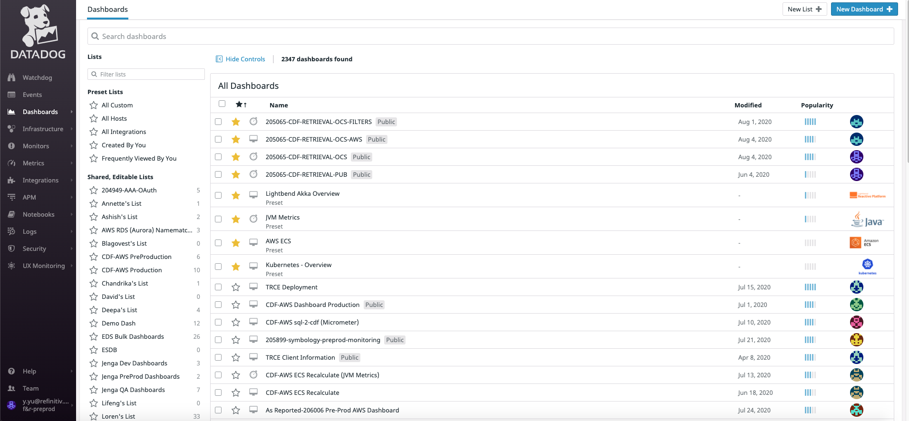
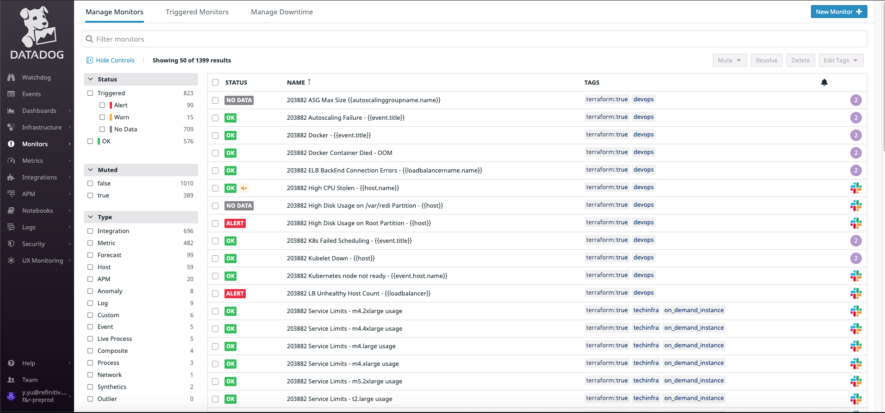
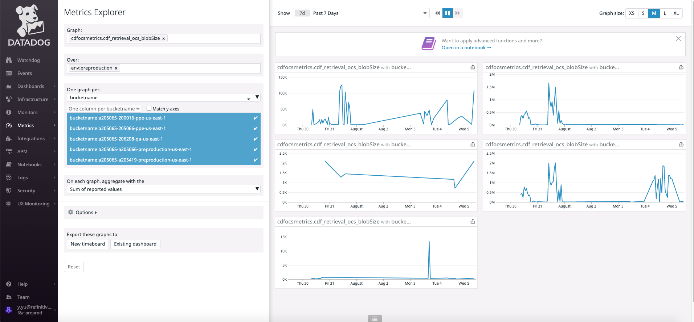

# DataDog 101

> <https://gitpitch.com/uname-yang/Slides/datadog101>

## 1 Overview

- Dashboards
- Infrastructure
- Monitors
- Metrics
- Integrations
- APM

### example: quick look










## 2 Collection

> Getting Metrics and Events into Datadog

### Integrations

1. Integrations with [AWS,Gitlab ...]
2. Integrations with [Mysql,Nginx ...]
3. Notification Integrations [Slack,Webhooks ...]
4. Frameworks, Libraries, Trace [Python,Java ...]

- <https://docs.datadoghq.com/integrations/amazon_web_services>
- <https://docs.datadoghq.com/integrations/amazon_ecs/>
- <https://docs.datadoghq.com/integrations/mysql/>
- <https://docs.datadoghq.com/tracing/setup/>


### Tracing Java Applications

#### Install the Agent

> <https://docs.datadoghq.com/getting_started/agent/>

The Datadog Agent is software that runs on your hosts. It collects events and metrics from hosts and sends them to Datadog, where you can analyze your monitoring and performance data.


#### Instrument Java Applications

> <https://docs.datadoghq.com/tracing/setup/java/>


```bash
wget -O dd-java-agent.jar 'https://repository.sonatype.org/service/local/artifact/maven/redirect?r=central-proxy&g=com.datadoghq&a=dd-java-agent&v=LATEST'
```

Finally, add the following JVM argument when starting your application in your IDE, Maven or Gradle application script, or java -jar command:

```bash
export DD_SERVICE_NAME=cdf-retrieval-ocs-205065-sharedservices
export DD_AGENT_HOST=localhost
export DD_TRACE_AGENT_PORT=8126
export DD_TRACE_GLOBAL_TAGS=env:local,keyword:cdf

java -javaagent:<DD-JAVA-AGENT-PATH>.jar \
     -Ddd.agent.host=$DD_AGENT_HOST \
     -Ddd.agent.port=$DD_TRACE_AGENT_PORT \
     -jar <YOUR_APPLICATION_PATH>.jar
```

### Tags

> <https://docs.datadoghq.com/getting_started/tagging/>

#### example: tags on metrics

### Agent Architecture

- <https://github.com/DataDog/dd-agent/wiki>


## 3 Dashboard

> Using data you have collected


### example: Dashboard


## 4 Monitors: Notifications and Alarm

> Monitors can also be thought of as alerts nand notifications.

### example: Monitors

## 5 docs and tickets

- <https://docs.datadoghq.com/>
- <https://app.datadoghq.com/help>
